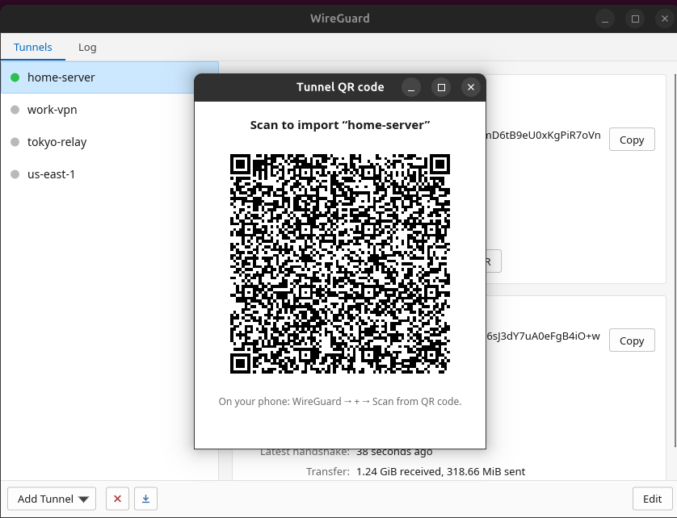

<div align="center">

# wireguard-gui

A native Linux desktop client for WireGuard.

Built with Rust + Slint. No Electron. No WebView. No NetworkManager layer. It
manages plain `/etc/wireguard/*.conf` tunnels through `wg` and `wg-quick`, and
keeps root operations behind a small auditable Rust helper.


[](https://github.com/JamilleJung/wireguard-gui/actions/workflows/ci.yml)
[](https://github.com/JamilleJung/wireguard-gui/releases/latest)
[](LICENSE)


</div>

Prefer the terminal? The sibling
[`wireguard-tui`](https://github.com/JamilleJung/wireguard-tui) provides the same
project philosophy as a keyboard-driven terminal UI.

## 💡 Design philosophy

This project is intentionally small.

It does not try to become a WireGuard platform, daemon, configuration database,
or NetworkManager replacement. It stays close to the Linux WireGuard workflow:
plain `.conf` files in `/etc/wireguard`, `wg`, `wg-quick`, `wg show`,
`wg showconf`, `wg syncconf`, `wg-quick save`, systemd `wg-quick@<name>` units
where available, and the system journal.

The GUI and TUI are separate first-class tools. Install the one you want. Hack
the one you want. They share a privilege model and project direction, but there
is no mandatory runtime core, daemon, or hidden platform layer.

The goal is a native client that is easy to use, easy to inspect, easy to fork,
and easy to extend without turning the project into a framework.

## 🤔 Why this exists

Linux already has strong WireGuard primitives. What many desktop users miss is a
small native client that makes the routine workflow visible: import a config,
bring a tunnel up, inspect the peer state, edit the plain file, see logs, and
turn on boot-time activation when systemd is present.

NetworkManager was the original spark, but this project is not only a
NetworkManager workaround. The broader idea is to keep the clarity of a desktop
client while staying close to the tools Linux WireGuard users already know.

## 🖼️ Screenshots

| Active tunnel | Inactive tunnel |
|---|---|
|  |  |

| Config editor | QR view |
|---|---|
|  |  |

## ✨ What it does

### 📋 Everyday use

- Lists tunnels from `/etc/wireguard`.
- Shows active/inactive state.
- Activates and deactivates tunnels with `wg-quick up` / `wg-quick down`.
- Shows live connection health from latest handshakes.
- Shows live transfer totals and throughput.
- Imports `.conf` files.
- Imports QR-code images.
- Creates a new tunnel from scratch with generated keys and Interface-only,
  full-tunnel, or split-tunnel presets.
- Shows a tunnel as a QR code for mobile import.
- Copies interface and peer public keys.
- Toggles start-on-boot using systemd `wg-quick@<name>` when systemd is present.
- Toggles a helper-managed kill switch for active tunnels using nftables
  (preferred) or iptables/ip6tables; auto-allows established SSH traffic.
- Provides a tray menu on desktops with StatusNotifier/AppIndicator support.

### ✏️ Editing and config

- Opens a native editor window for tunnel configs.
- Supports raw config editing.
- Supports a structured form for simple multi-peer configs.
- Keeps advanced configs in raw-text mode when fields cannot be represented.
- Generates WireGuard keypairs with `wg genkey` / `wg pubkey`.
- Generates preshared keys with `wg genpsk`.
- Copies generated public keys and config text.
- Validates configs before save.
- Saves through the helper with backups and atomic replacement.
- Renames and removes tunnels through helper verbs.
- Exports all tunnel configs to a zip archive.

### ⚙️ Advanced operations

- Copies the live running config with `wg showconf`.
- Applies compatible changes to an active tunnel with `wg syncconf`.
- Saves live running state back to disk with `wg-quick save`.
- Shows recent helper and `wg-quick@*` journal entries in a Log tab.
- Offers Easy mode for everyday actions, including tunnel creation, and
  Advanced mode for raw/runtime operations.
- Remembers the Easy/Advanced preference under the user config directory.

### 🚨 Setup checks

On first run, the app opens a setup window when critical requirements are
missing. The check is read-only and covers:

- `wg` and `wg-quick`
- the privileged helper
- helper authorization
- `/etc/wireguard`
- systemd for start-on-boot
- journald for the Log tab
- `resolvconf` or systemd-resolved for configs that use `DNS =`

The automatic setup action only installs safe prerequisites such as
`wireguard-tools`, a resolvconf provider, and `/etc/wireguard`. It does not
install random config files, connect tunnels, or enable start-on-boot.

## ❌ What it deliberately does not do

- No NetworkManager dependency.
- No Electron.
- No WebView.
- No browser dashboard.
- No mandatory daemon or background service.
- No central runtime core shared by GUI and TUI users.
- No hidden config database.
- No bundled WireGuard kernel module.
- No root GUI.

## 💡 How it works

The GUI is a normal user process. It reads UI state, renders Slint views, and
calls a small helper for operations that require root.

The helper uses fixed verbs and fixed paths. It reads and writes only
`/etc/wireguard/<name>.conf`, calls standard WireGuard tools, and logs mutating
actions through `logger` so they are visible in the journal.

The app does not translate configs into a project-specific database. The source
of truth remains the plain WireGuard config file.

## 📦 Install

### 📦 Prebuilt packages

The release page normally includes:

- `wireguard-gui_*_amd64.deb`
- `wireguard-gui-*-x86_64-linux.tar.gz`
- `wireguard-gui-*-aarch64-linux.tar.gz`
- `wireguard-gui-*-x86_64.AppImage` when the AppImage job succeeds
- `SHA256SUMS`
- `SHA256SUMS.minisig` when signing is configured
- `minisign.pub`

On Debian, Ubuntu, and Mint, the `.deb` is the simplest path because it installs
the binary, helper, desktop entry, icon, and polkit rule.

The AppImage is convenient for trying the UI, but privileged actions work best
when the system helper is installed. Run `./install.sh` once, or install the
`.deb`, if you want passwordless tunnel control.

### 🛠️ Build from source

```sh
git clone https://github.com/JamilleJung/wireguard-gui.git
cd wireguard-gui
./install.sh
```

`install.sh` detects the package manager, installs build dependencies and
`wireguard-tools`, builds the release binary as the invoking user, installs the
binary/helper/desktop files, and configures helper authorization.

Supported package managers:

| Distro family | Package manager |
|---|---|
| Debian / Ubuntu / Mint | `apt` |
| Fedora / RHEL / Rocky | `dnf` / `yum` |
| Arch / Manjaro / EndeavourOS | `pacman` |
| openSUSE | `zypper` |
| Alpine | `apk` |
| Void | `xbps-install` |
| Solus | `eopkg` |

Auth backend:

```sh
./install.sh           # sudoers drop-in, default
./install.sh --polkit  # polkit rule instead
```

Uninstall:

```sh
./install.sh uninstall
```

Tunnel configs in `/etc/wireguard` are left in place.

## ✅ Verify releases

Download the artifact you want plus `SHA256SUMS`. When `SHA256SUMS.minisig` is
attached, verify both the signature and checksum:

```sh
minisign -Vm SHA256SUMS -P RWSrokrj4nWGDhUf409+6yXuqPfF7WQuGtSk/PdsnTWKwfOpb3Hv4DxG
sha256sum -c SHA256SUMS --ignore-missing
```

The public key is also committed as `minisign.pub`:

```sh
minisign -Vm SHA256SUMS -p minisign.pub
```

If the signature is not attached for a release, use `SHA256SUMS` as an integrity
check only and prefer building from source for higher assurance.

## 🎮 Usage

Launch from the application menu or from a terminal:

```sh
wireguard-gui
# or the shorter alias:
wg-gui
```

Non-window CLI paths for scripts:

```sh
wireguard-gui --version   # or: wg-gui --version
wireguard-gui --help      # or: wg-gui --help
```

The left pane lists tunnels. The right pane shows interface and peer details.
Use Add Tunnel to import a file, import a QR image, or create a new tunnel. Use
Edit for raw config editing and the structured multi-peer form. Use Advanced
mode for export, running config, kill switch, and save-live operations.

## 🛡️ Security and privilege model

Designed with a small auditable privilege boundary:

- The GUI runs as a normal user.
- Root operations go through `wg-helper`.
- Authorization is scoped to the helper path, not to the GUI binary.
- Default source install uses a sudoers drop-in for the helper only.
- `./install.sh --polkit` installs a polkit rule for the helper only.
- If neither passwordless path is available, the app falls back to `pkexec`.

The helper exposes fixed verbs only:

`list`, `active`, `read`, `dump`, `up`, `down`, `save`, `rename`, `delete`,
`enable`, `disable`, `is-enabled`, `sync`, `showconf`, `persist`, `log`,
`killswitch-status`, `killswitch-enable`, and `killswitch-disable`.

Helper hardening:

- Fixed `PATH`.
- Fixed `/etc/wireguard` root.
- Tunnel names must match `^[A-Za-z0-9][A-Za-z0-9_.-]{0,14}$`.
- Names containing `..`, slashes, backslashes, empty strings, or leading symbols
  are rejected.
- No caller-controlled root destination paths.
- No `eval` or `sh -c` around caller-controlled values.
- Command calls use argv-style arguments.
- Operations that may hang are wrapped with timeouts.
- Saves and renames validate config shape in the helper before replacing files.
- Saves and renames write a temp file, set mode `0600`, best-effort `sync -f`,
  and rename into place.
- Overwrite, rename, and delete create timestamped backups first.
- Mutating actions are logged without private keys.
- Kill switch verbs require an active `wg-quick` tunnel with a WireGuard fwmark,
  use iptables/ip6tables when present, and do not install a daemon.

Important WireGuard reality: `wg-quick` supports `PreUp`, `PostUp`, `PreDown`,
and `PostDown`. Those hooks run as root when a tunnel is activated. The editor
warns when a config contains them, but the project does not remove them because
they are part of the plain WireGuard workflow. Treat imported configs like
scripts you might run as root.

QR and zip export contain private keys. Treat them like the config file itself.

## 🔧 Hacking on it

This is MIT open source. Fork it to hack on your own ideas.

### 🗺️ Codebase map

| Path | Purpose |
|---|---|
| `ui/app.slint` | Slint layout, controls, editor, setup window |
| `src/main.rs` | App startup, tray, UI callbacks, live polling |
| `src/ui_bridge/editor_form.rs` | Structured editor parsing/serialization |
| `src/backend.rs` | Helper client, WireGuard/system operations, QR/export |
| `src/config.rs` | WireGuard config parsing and validation |
| `src/create.rs` | Easy Mode tunnel templates and defaults |
| `src/clipboard.rs` | Single-field copy normalization |
| `src/secrets.rs` | Secret redaction and script-hook detection |
| `src/validation.rs` | Tunnel name validation and import-name sanitization |
| `src/doctor.rs` | Read-only system checks and setup hints |
| `src/bin/wg-helper.rs` | Privileged Rust helper and fixed verb surface |
| `install.sh` | Distro-aware source installer |
| `tests/helper-validation.sh` | Shell tests for helper name validation |
| `packaging/` | Desktop entry, icon, polkit, AUR/RPM/APK/Void metadata |
| `.github/workflows/` | CI and release automation |

### ✅ Build and test

```sh
cargo fmt --all - --check
cargo clippy --all-targets - -D warnings
cargo test
cargo build --release
bash -n install.sh
bash -n tests/installer-sanity.sh
shellcheck -S warning install.sh tests/helper-validation.sh tests/installer-sanity.sh
bash tests/helper-validation.sh target/release/wg-helper
bash tests/installer-sanity.sh
```

### 🚀 Run from source

```sh
cargo run --release
```

During development, the binary can use the in-tree helper. You can also point it
at a helper explicitly:

```sh
cargo build --bin wg-helper
WG_HELPER=/absolute/path/to/wg-helper cargo run
```

In release builds, `WG_HELPER` is ignored unless `WG_ALLOW_UNSAFE_HELPER=1` is
set and the target is an absolute, root-owned, non-world-writable file. That is
intentional: a helper override can become a root boundary.

### 🔒 Adding privileged behavior

Add a helper verb only when it maps to a concrete WireGuard operation. Keep the
input shape fixed, validate tunnel names before filesystem access, use fixed
paths, avoid shell expansion, create backups before destructive changes, and do
not log private keys.

## 🐛 Troubleshooting

- `wg-quick` fails with `resolvconf: command not found`: install `openresolv` or
  use systemd-resolved.
- The helper prompts every time: run `./install.sh` or `./install.sh --polkit`
  so the installed helper path is authorized.
- The helper is missing: install the `.deb` or run `./install.sh`.
- Kill switch fails: the tunnel must be active and the system needs nftables, iptables, or ip6tables available.
- Start-on-boot is unavailable: the system does not provide `systemctl`.
- The Log tab is empty: `journalctl` is missing or the system is not using
  journald.
- The tray icon does not appear: the desktop needs a StatusNotifier or
  AppIndicator host. GNOME usually needs an extension.
- A tunnel managed elsewhere behaves strangely: stop managing the same WireGuard
  interface through NetworkManager and this app at the same time.
- Blank window or invisible inputs: make sure OpenGL/EGL and the Slint runtime dependencies are installed. The packaged build and installer install these.

## 🚧 Known limitations

- Start-on-boot is systemd-only.
- The release workflow builds x86_64 and aarch64 tarballs; `.deb` and AppImage
  coverage remains x86_64-focused.
- The structured editor handles the common Interface/Peer fields for multiple
  peers; configs with hooks, `Table`, `SaveConfig`, or unknown directives stay
  in raw text.
- The create flow is an editor-style review window with presets, not a
  multi-page provisioning wizard.
- The tray icon depends on desktop StatusNotifier/AppIndicator support.
- AppImage privileged actions need a system helper for the smooth path.
- The kill switch is intentionally helper-managed firewall state, not a daemon
  or persistent firewall manager.
- The project does not bundle WireGuard tools or kernel modules.

## 🗺️ Roadmap

- More distro packages where maintainers want them (COPR, official Alpine/Void).

## ⭐ Star this project

If `wireguard-gui` is useful to you, **please give it a star on GitHub** - it
genuinely helps other people discover the project and motivates further work.

👉 **[Star wireguard-gui on GitHub](https://github.com/JamilleJung/wireguard-gui)** ⭐

You can also **watch** the repo for releases and **fork** it to hack on your own ideas.

## ☕ Buy me a coffee

This is a free, open-source project built in spare time. If it saved you some
trouble and you'd like to say thanks, a coffee is hugely appreciated 💛

<div align="center">

[](https://www.buymeacoffee.com/jamillejung)

**[☕ buymeacoffee.com/jamillejung](https://www.buymeacoffee.com/jamillejung)**

</div>

## 📄 License

MIT. WireGuard is a registered trademark of Jason A. Donenfeld. This is an
independent, unofficial client and is not affiliated with or endorsed by the
WireGuard project.
