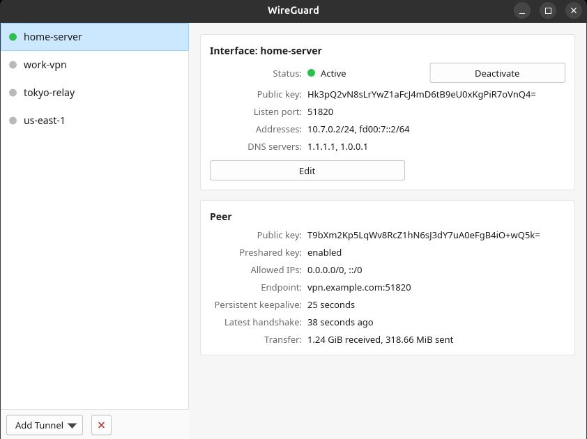
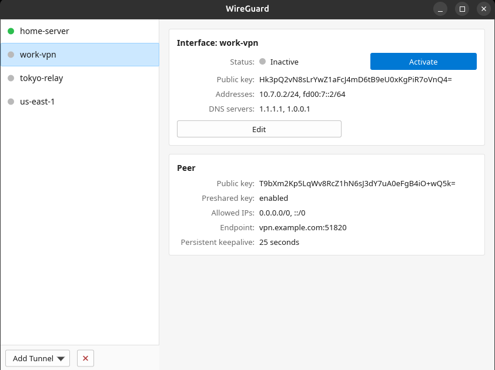
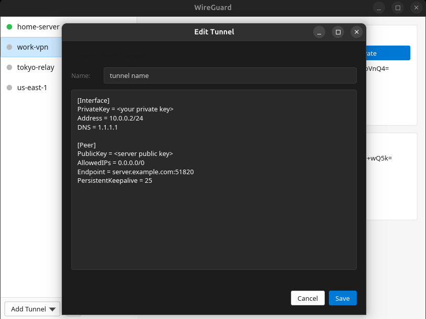

<div align="center">

# 🐉 wireguard-gui

**A native Linux GUI for managing WireGuard tunnels — modelled on the WireGuard for Windows client.**

Tunnel list on the left, an Interface/Peer detail pane on the right, one-click
Activate/Deactivate, import from `.conf`, an inline editor with config
validation, and live handshake/transfer status.

Written in **Rust** with the [Slint](https://slint.dev) toolkit — compiles to a
single native binary. No Electron, no web view.



[](https://github.com/JamilleJung/wireguard-gui/actions/workflows/ci.yml)
[](https://github.com/JamilleJung/wireguard-gui/releases/latest)
[](LICENSE)


</div>

---

## ✨ Features

- 📜 **Tunnel list** of everything under `/etc/wireguard`, with a live green/grey active dot.
- 🔌 **Activate / Deactivate** with one click (`wg-quick up` / `down`).
- 🧾 **Interface card** — status, public key, listen port, addresses, DNS.
- 🛰️ **Peer card(s)** — public key, preshared-key indicator, allowed IPs, endpoint,
  persistent keepalive, **latest handshake** and **transfer**, polled live every second.
- 📥 **Import** one or many `.conf` files (single imports open an editor so you can
  **name the tunnel yourself**; bulk imports auto-deduplicate), or **import from a QR-code image**.
- 🔑 **Generate keypairs** — new tunnels open with a fresh private key and a live public-key field.
- 📱 **Show QR** — display a tunnel as a QR code to scan into the WireGuard mobile app.
- 📦 **Export** all tunnels to a `.zip`; **copy** public keys / config / log to the clipboard.
- 📝 **Inline editor** with **config validation** (keys, addresses, endpoint, …) before saving.
- ✏️ **Rename** / **Remove** tunnels; **Log** tab; **Start-on-boot** toggle.
- 🗔 **System-tray icon** with per-tunnel activate/deactivate (where the desktop supports SNI).
- 🔒 **Tiny, auditable privilege surface** (see below).

---

## 📸 Screenshots

| Tunnel detail (active) | Inactive tunnel | Config editor |
|:---:|:---:|:---:|
|  |  |  |

---

## 🚀 Install (one command)

```sh
git clone https://github.com/JamilleJung/wireguard-gui.git
cd wireguard-gui
./install.sh
```

That's it. The installer:

1. **Detects your distro's package manager** and **auto-installs every missing
   dependency** — C toolchain, `pkg-config`, the libraries Slint needs
   (`fontconfig`, `libxkbcommon`), an OpenGL runtime, and **`wireguard-tools`** itself.
2. **Installs Rust automatically** (via [rustup](https://rustup.rs)) if `cargo` isn't already present.
3. **Builds** the release binary.
4. **Installs** the binary, the privileged helper, a `.desktop` launcher and icon.
5. Adds a **`sudoers` drop-in** so the app never needs your password at runtime
   (falls back to `pkexec` if that step is skipped).

Then launch **WireGuard** from your application menu, or run `wireguard-gui`.

> Prefer a single line?
> ```sh
> git clone https://github.com/JamilleJung/wireguard-gui.git && cd wireguard-gui && ./install.sh
> ```

### ✅ Tested package managers

| Distro family            | Package manager | Auto-installed deps |
|--------------------------|-----------------|---------------------|
| Debian / Ubuntu / Mint   | `apt`           | ✅ |
| Fedora / RHEL / Rocky    | `dnf` / `yum`   | ✅ |
| Arch / Manjaro / EndeavourOS | `pacman`    | ✅ |
| openSUSE                 | `zypper`        | ✅ |
| Alpine                   | `apk`           | ✅ |
| Void                     | `xbps`          | ✅ |
| Solus                    | `eopkg`         | ✅ |

On an unrecognised distro the installer tells you exactly which packages to add
manually, then still builds and installs.

### Uninstall

```sh
./install.sh uninstall
```

### Auth backend: sudoers (default) or polkit

```sh
./install.sh            # sudoers drop-in (light & fast — the default)
./install.sh --polkit   # polkit rule instead (cleaner desktop integration)
```

Both make privileged tunnel control passwordless for your active local session.
`sudoers` is simplest; `polkit` is the more "native desktop app" path (and is
what the `.deb` uses automatically).

---

## 📦 Download prebuilt (no compiler needed)

Every tagged release on the [**Releases**](https://github.com/JamilleJung/wireguard-gui/releases)
page ships these, built by GitHub Actions:

| Artifact | For |
|----------|-----|
| `wireguard-gui_*_amd64.deb` | Debian/Ubuntu — `sudo apt install ./wireguard-gui_*_amd64.deb` (sets up the polkit rule automatically) |
| `wireguard-gui-*-x86_64.AppImage` | Any distro — `chmod +x *.AppImage && ./*.AppImage` |
| `wireguard-gui-*-x86_64-linux.tar.gz` | Portable binary bundle + `install.sh` |
| `SHA256SUMS` | Checksums for everything above |

Verify your download — checksums, and a minisign signature over them:

```sh
# 1) checksums
sha256sum -c SHA256SUMS --ignore-missing

# 2) signature (needs `minisign`; public key also ships as minisign.pub)
minisign -Vm SHA256SUMS -P RWSrokrj4nWGDhUf409+6yXuqPfF7WQuGtSk/PdsnTWKwfOpb3Hv4DxG
```

> The `.deb` is the smoothest prebuilt option (desktop integration + passwordless
> polkit). The AppImage is fully portable; for passwordless privileged actions it
> still benefits from a system helper (run `install.sh` once, or use the `.deb`).

---

## 🛠️ Manual build (for developers)

Requirements: a Rust toolchain (`cargo`), `wireguard-tools`, and the dev headers
for `fontconfig` + `libxkbcommon` (see the table your distro uses below).

```sh
cargo build --release       # → target/release/wireguard-gui
cargo run --release         # run straight from source
```

In dev mode the app uses the in-tree `packaging/wg-helper`. For passwordless
operation either run `./install.sh`, point a `sudoers` drop-in at the helper, or
let it fall back to `pkexec`. Override the helper path with
`WG_HELPER=/path/to/wg-helper`.

<details>
<summary>Dependency package names per distro</summary>

| Distro | Packages |
|--------|----------|
| Debian/Ubuntu | `build-essential pkg-config libfontconfig-dev libxkbcommon-dev libgl1 libegl1 libdbus-1-dev wireguard-tools` |
| Fedora/RHEL | `gcc gcc-c++ make pkgconf-pkg-config fontconfig-devel libxkbcommon-devel mesa-libGL mesa-libEGL dbus-devel wireguard-tools` |
| Arch | `base-devel fontconfig libxkbcommon libglvnd dbus wireguard-tools` |
| openSUSE | `gcc gcc-c++ make pkg-config fontconfig-devel libxkbcommon-devel Mesa-libGL1 Mesa-libEGL1 dbus-1-devel wireguard-tools` |
| Alpine | `build-base pkgconf fontconfig-dev libxkbcommon-dev mesa-gl mesa-egl dbus-dev wireguard-tools` |

</details>

---

## 🖥️ Usage

1. Launch **WireGuard** (app menu) or `wireguard-gui`.
2. Pick a tunnel on the left to see its Interface/Peer details and live status;
   toggle **Start on boot**, **Show QR**, or **Copy** the public key.
3. **Activate / Deactivate** with the button in the Interface card (or from the
   tray icon, per tunnel).
4. **Add Tunnel ▾** → *Import from file…* / *Import from QR code…* /
   *Add empty tunnel…* (a keypair is generated for you) / *About…*.
5. **Edit** opens the editor (rename, **Generate keypair**, **Copy config**,
   validate-on-Save). The **✕** removes a tunnel; the **⤓** exports all to a zip.
6. The **Log** tab shows recent activity (`journalctl -t wireguard-gui` + `wg-quick`).

---

## 🔐 How privilege works

The app runs as your normal user. Everything that needs root — reading
`/etc/wireguard`, `wg show`, `wg-quick up/down` — is funnelled through a single,
auditable shell script, **`wg-helper`**, which validates every tunnel name and
exposes only a fixed set of verbs (`list`, `read`, `dump`, `up`, `down`, `save`,
`delete`, …).

`install.sh` whitelists **only that script** (via a `sudoers` drop-in, or a
`polkit` rule with `--polkit` / the `.deb`), so the GUI never needs your password
at runtime and the privileged surface stays tiny. If neither is set up, the app
falls back to `pkexec` (which prompts).

**Hardening built into `wg-helper`:**

- **Fixed paths** — `WG_DIR` is hard-coded to `/etc/wireguard`; nothing comes from
  the caller's environment.
- **No path traversal** — tunnel names must match `^[A-Za-z0-9][A-Za-z0-9_.-]{0,14}$`
  and may never be `.`/`..` or contain `..`, so the target path can't escape the
  config directory. (Verified: `read ../../etc/passwd` is rejected.)
- **Atomic writes** — `save` writes to a temp file and `rename()`s it into place,
  so a crash mid-write can't leave a truncated config.
- **Backups before destruction** — every `save` (overwrite) and **`delete`** first
  copies the current config to `/etc/wireguard/.backup/<name>.conf.<timestamp>`
  (mode `600`). The delete button is deliberately reversible.
- **Audit log** — `save`/`delete`/`up`/`down`/`enable`/`disable` and every backup
  are logged to the system journal:
  ```sh
  journalctl -t wireguard-gui
  ```

---

## 🩹 Troubleshooting

- **A tunnel won't activate** — check the config with `Edit`; the validator flags
  bad keys/addresses/endpoints. Also confirm `wg-quick up <name>` works in a terminal.
- **"Couldn't open editor" / pkexec prompts every time** — re-run `./install.sh`
  to (re)create the `sudoers` drop-in.
- **Blank window / no GPU** — ensure an OpenGL runtime is installed (the installer
  handles this); on headless/odd setups try `SLINT_BACKEND=winit-software wireguard-gui`.

---

## ⚠️ Known limitations

- **Built & tested on x86_64, GNOME/Wayland.** It should work on other desktops
  and X11, but those are less tested. Prebuilt binaries are x86_64 only — other
  architectures can build from source.
- **The system-tray icon** uses the StatusNotifierItem standard. It shows on KDE
  and most trays out of the box; on **GNOME it needs the AppIndicator extension**.
- **Multiple peers** are shown (one card each) and editable via the raw config,
  but there's no dedicated add/remove-peer UI yet.
- **AppImage privileged actions** work best with a system helper present — run
  `install.sh` once, or use the `.deb`, for passwordless control.

---

## 🧗 The story behind it — pain points & fixes

I built this because the existing Linux options either hide WireGuard behind
NetworkManager (which bit me hard) or don't look/behave like the clean Windows
client. Getting there meant fighting through some genuinely nasty issues — written
up here in case they save you the days they cost me.

### 1. NetworkManager silently ate my WireGuard peer
The original symptom that started everything: the VPN just stopped working —
"DNS not resolving", no internet when the tunnel was up. The cause turned out to
be **NetworkManager dropping the entire `[Peer]` section** of the connection (a
long-standing cross-distro bug, usually triggered by editing/saving WireGuard in
a GUI). With no peer, NM still set a default route into the empty tunnel and
black-holed *all* traffic, DNS included.
**Fix:** stop managing the tunnel through NetworkManager entirely — run it
standalone via `wg-quick` + systemd, and mark `wg*` as `unmanaged` in NM so it
can never touch (and re-break) the interface again. That experience is exactly
why this app talks to `wg-quick` directly instead of going through NM.

### 2. Slint text inputs rendered *blank* on a light window — the big one
The editor's `LineEdit`/`TextEdit` showed up **completely empty** on a white
background, visible only when focused. It happened with **every** renderer
(femtovg, software, *and* Skia), so it wasn't GPU/glyph-cache specific — which
ruled out the obvious suspects and cost the most time.
The real cause turned out to be **contrast, not rendering**: with the OS in dark
mode, Slint's std-widgets pick a dark palette where the unfocused input fill is
white-at-6%-opacity with white text. Put that over a white window and it's
white-on-white — invisible; the focused state uses a near-black fill, which is
why only the focused field showed. (Confirmed against the Fluent style source.)
**Fix:** force the **light** palette so the inputs use dark-text-on-light fills
that match the white window — `Palette.color-scheme = ColorScheme.light` plus the
`fluent-light` style in `build.rs`. (Related gotcha ruled out along the way: an
explicit `min-height` on a `TextEdit` can also suppress its text on femtovg,
[Slint #6896](https://github.com/slint-ui/slint/issues/6896).)

### 3. Running privileged operations without nagging for a password
`wg`/`wg-quick` need root, but I didn't want a password prompt on every status
poll. **Fix:** a single small, auditable `wg-helper` script with a fixed verb set
and strict tunnel-name validation, whitelisted (and *only* it) in a `sudoers`
drop-in — with a `pkexec` fallback when that isn't set up.

### 4. "It should just install" on any distro
Build-from-source on Linux means a C toolchain, `pkg-config`, fontconfig +
libxkbcommon headers, an OpenGL runtime, `wireguard-tools`, and Rust — and every
distro names them differently (Debian and Arch in particular love to be missing
*something*). **Fix:** `install.sh` detects the package manager, maps the right
package names, installs whatever's missing (Rust included, via rustup), then
builds and installs — one command, anywhere.

### Small stuff that still mattered
- Status banners that never went away → auto-dismiss after a few seconds.
- Imports clobbering same-named tunnels → single imports open the editor to name
  them; bulk imports auto-deduplicate.
- Config typos only surfacing at activation time → validate the config on Save.

---

## 🤝 Contributing

Issues and PRs welcome! The code is small and tidy:

| Path | Purpose |
|------|---------|
| `ui/app.slint` | The entire UI (Slint markup). |
| `src/backend.rs` | Privilege handling, `wg` orchestration, config parse + validation. |
| `src/main.rs` | Wires UI callbacks to the backend. |
| `packaging/wg-helper` | The single privileged entry point. |
| `install.sh` | Universal build + install. |

---

## ⭐ Star this project

If wireguard-gui is useful to you, **please give it a star on GitHub** — it
genuinely helps other people discover the project and motivates further work.

👉 **[Star wireguard-gui on GitHub](https://github.com/JamilleJung/wireguard-gui)** ⭐

You can also **watch** the repo for releases and **fork** it to hack on your own ideas.

---

## ☕ Buy me a coffee

This is a free, open-source project built in spare time. If it saved you some
trouble and you'd like to say thanks, a coffee is hugely appreciated 💛

<div align="center">

[](https://www.buymeacoffee.com/jamillejung)

**[☕ buymeacoffee.com/jamillejung](https://www.buymeacoffee.com/jamillejung)**

</div>

---

## 📄 License

[MIT](LICENSE). WireGuard is a registered trademark of Jason A. Donenfeld; this
is an independent, unofficial client and is not affiliated with or endorsed by
the WireGuard project.
